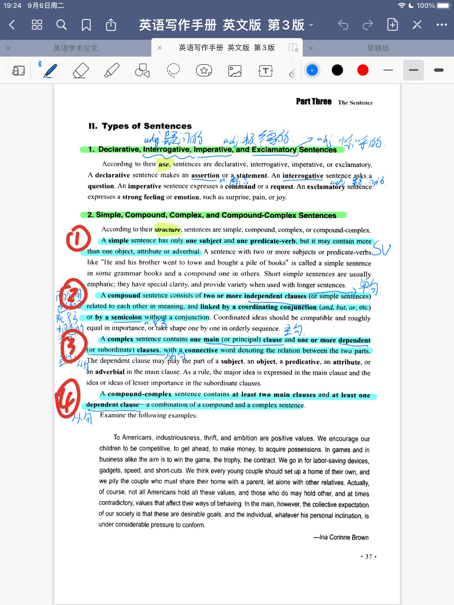

Now look at this mind map, it sumed up the types of sentences. For the types the book gives four classification criteria - usage, structure, rhetorical point of view and length.

The first classification criteria is usage. **For the usage**, there are four types: declarative, interrogative, imperative and exclamatory sentences. The declarative sentences means making assertion and statement, the (adj.) sentences means (v-ing) (n.).   （懒得写了，第一个括号是句子的种类，第二个需要动词的ing形式，如asking,making,expressing，第三个是对应下面分支的具体解释） 

The second classification criteria is structure. **For the structure**, there are four types: simple, compound, complex and compound-complex sentences. (念定义)①②③④可以按照图片蓝色所划部分照着念，注意书上的A全部换成The，然后破折号看怎么代替一下，比如It's.
And for the short simple sentence, it often used to emphaisize the important view, while long complex sentence often to state complex ideas clearly and accurately.

The third classification criteria is rhetorical point of view. **For the rhetorical point of view**, there are three types: loose, periodic and balanced sentences. When the main idea appears before all supplement infomation, it's *loose sentence*. The kind of sentence often make your view easier, simpler, natural and direct. In contrast, the *periodic sentence* means the main idea locates at the end of all supplement infomation. 
It often makes your idea complex, emphatic, formal and literary. When giving two parallel clauses similar in structure but contrasted in meaning, it's balanced sentence. The balanced sentence often impressive, pleasing to hear. And it often used in formal writing.

The last classification criteria is the length of sentence. The short sentence usually to be emphatic. So it often applied to presenting facts and ideas. Long sentence often used to express complex ideas with precision such as views and theories, and it also can be applied to describing things with many details.